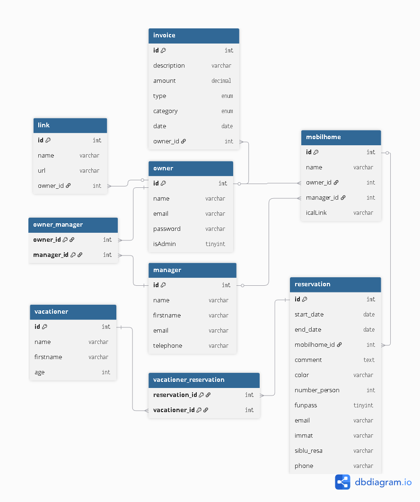

# 🏠 Mobilhomev2

Application **fullstack** de gestion de mobilhomes développée en **React + .NET 8**.

Projet personnel conçu pour mettre en pratique une architecture structurée inspirée de **CQRS** et **Clean Architecture**, avec une séparation claire entre logique métier et infrastructure.

---

## 🎯 Objectif du projet

Construire une application complète permettant à un propriétaire de :

- Gérer ses mobilhomes
- Gérer ses managers
- Gérer les réservations
- Gérer les vacanciers
- Visualiser les réservations via un calendrier dynamique
- Gérer des liens personnalisés

L’accent est mis sur la **clarté de l’architecture**, la séparation des responsabilités et la cohérence métier.

---

## 🧱 Architecture Back-end

Le backend est structuré en 3 couches principales :

### 📦 Domain
- Entités métier (Mobilhome, Reservation, Owner, Manager, etc.)
- Logique métier
- Indépendant d’Entity Framework

### 🧠 Application
- UseCases (Command / Query)
- Handlers
- DTOs
- Interfaces Repository
- Séparation lecture / écriture (inspirée CQRS)

### 🗄 Infrastructure
- Entity Framework Core
- Repositories
- Mappers (Model ↔ Entity)
- Authentification JWT
- Configuration base de données

---

## 🔐 Authentification & Sécurité

- Authentification JWT
- Claim `NameIdentifier` (ownerId)
- Claim `Role` (admin / user)
- Protection via `[Authorize]`
- Protection par rôle `[Authorize(Roles = "admin")]`
- Vérification systématique de l’ownerId via token

---

## 🖥️ Front-end

### Stack
- React
- TypeScript
- React Router
- Axios
- TailwindCSS
- Context API

### Principes appliqués

- Séparation composants / logique métier
- Services centralisés pour appels API
- Mise à jour optimisée du state après CRUD (sans refetch inutile)
- Gestion des rôles via décodage du token
- Structure modulaire des composants

---

## 📅 Calendrier des réservations

Implémentation personnalisée :

- Génération dynamique d’un mois (6 semaines fixes)
- Affichage Lundi → Dimanche
- Gestion des demi-journées (matin / après-midi)
- Colorisation automatique selon les réservations
- Projection sur mois précédent / courant / suivant

---

## 🗄️ Base de données

### SGBD
MySQL

### Relations principales

- Owner → Mobilhomes (1-N)
- Mobilhome → Reservations (1-N)
- Reservation ↔ Vacationer (N-N via table pivot)

### Gestion des suppressions

- Suppression en cascade configurée sur la table pivot `vacationer_reservation`

---

## ⚙️ Technologies utilisées

### Back-end
- .NET 8
- C#
- Entity Framework Core
- MySQL
- JWT Authentication

### Front-end
- React
- TypeScript
- TailwindCSS

---

## 🗄️ Structure de la base de données

